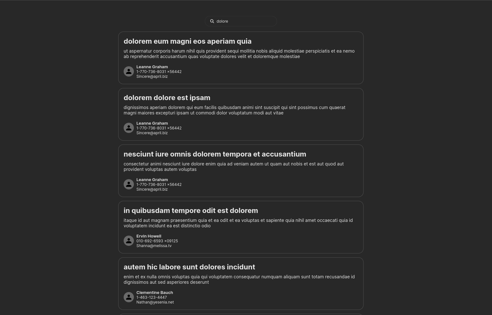
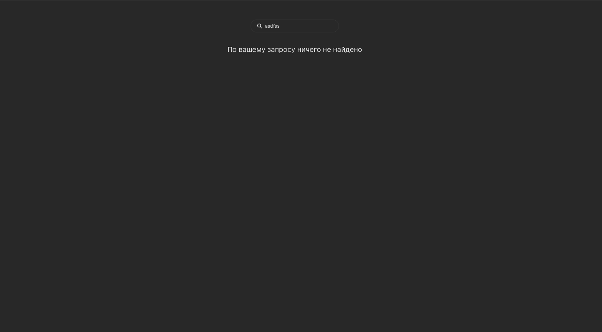
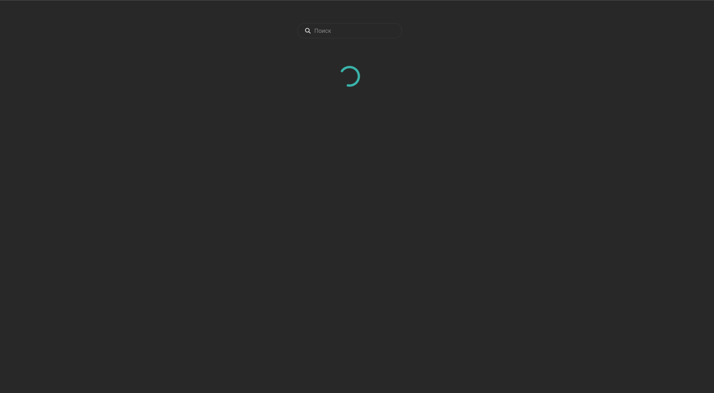

# Filterable List
Версия [проекта](https://github.com/r0astPiGGy/Post-List) с использованием TypeScript

Список постов, получаемых из [API](https://jsonplaceholder.typicode.com/).
Реализована фильтрация по заголовку поста, debounce, infinite scroll. Clean architecture

